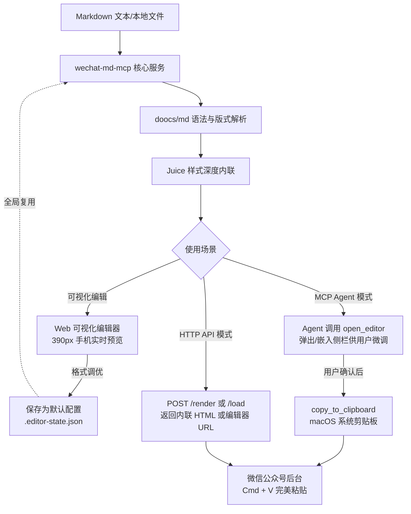

# wechat-md-mcp

<p align="center">
  <strong>本地 Markdown → 微信公众号排版服务（MCP + HTTP + 可视化编辑器）</strong><br>
  <span>基于 <a href="https://github.com/doocs/md">doocs/md</a> 官方排版内核，喂进 Markdown，吐出<strong>可直接 Cmd+V 粘贴进公众号编辑器的富文本</strong>。</span>
</p>

<p align="center">
  <a href="https://nodejs.org"></a>
  <a href="LICENSE"></a>
  <a href="https://modelcontextprotocol.io"></a>
  <a href="https://github.com/doocs/md"></a>
</p>

---

## 目录

- [核心特性](#-核心特性)
- [工作原理与流转图](#-工作原理与流转图)
- [快速开始](#-快速开始)
- [🖥 可视化编辑器](#-可视化编辑器)
- [🤖 MCP 客户端接入](#-mcp-客户端接入)
- [🧩 配置 Agent Skill（推荐）](#-配置-agent-skill推荐)
- [💬 在 Agent 中使用](#-在-agent-中使用)
- [🌐 HTTP 服务接口](#-http-服务接口)
- [⚙️ 排版与渲染参数](#-排版与渲染参数)
- [⚠️ 关键避坑指南与排错](#-关键避坑指南与排错)
- [📂 项目结构](#-项目结构)
- [🛠 常用调试命令](#-常用调试命令)
- [📄 致谢与开源许可](#-致谢与开源许可)

---

## 🌟 核心特性

- 🎯 **一键直达微信剪贴板**：基于 macOS 富文本（`public.html` flavor）注入，排版完成后直接写入系统剪贴板，公众号后台直接 `Cmd+V` 即可完美呈现。
- 🖥 **内置三栏可视化编辑器**：原生轻量编辑器（零打包构建，开箱即用）。左边写 Markdown、中间 390px 手机宽度实时预览、右边调格式。支持打开/保存本地文件、自动 `.bak` 备份，调好格式点击「保存为默认」，全局所有调用均自动沿用。
- 🎨 **原汁原味 doocs/md 内核**：直接使用 doocs/md 官方渲染内核（`packages/core`），完整支持代码高亮、Mac 风格标题栏、KaTeX 数学公式、Mermaid 图表、注音、脚注与表格。
- ⚡️ **样式强制深度内联**：微信公众号后台会静默剔除 `<style>` 样式表和大部分 class 类名。本服务通过 Juice 引擎将所有 CSS 规则逐一计算并内联为 `style="..."` 行内属性，保证版式 100% 不变形。
- 🤖 **全主流 Agent 闭环交付**：原生支持 Claude Desktop、Claude Code、Cursor、Codex、WorkBuddy 等主流客户端。Agent 排版后通过 `open_editor` 自动把编辑器交给用户二次微调，确认无误再一键写剪贴板。
- 🔌 **端口自发现与双模式**：既是标准 Stdio MCP Server，也是支持智能端口顺延的轻量 HTTP 服务，任何语言或脚本皆可调用。

---

## 🔄 工作原理与流转图



---

## 🚀 快速开始

### 前置要求
- **Node.js >= 20**
- 剪贴板直拷工具 `copy_to_clipboard` 目前专为 **macOS** 设计（非 macOS 可通过编辑器下载 HTML、或调用 `save_html` / `preview_html` 获取 HTML 后手动复制）。

### 安装与启动

```bash
# 1. 克隆本仓库（仓库自包含内核，无需额外安装 doocs/md）
git clone https://github.com/rookit-ljt/wechat-md-mcp.git
cd wechat-md-mcp

# 2. 安装依赖
npm install

# 3. 运行冒烟测试确认环境
npm test

# 4. 根据需要启动服务
npm start            # 启动 HTTP 服务与可视化编辑器，默认监听 http://127.0.0.1:8788
npm run mcp          # 以 stdio 模式运行 MCP 服务
```

---

## 🖥 可视化编辑器

启动服务后，浏览器直接访问：**<http://127.0.0.1:8788/>**

```bash
npm start
```

### 核心功能与亮点

- **三栏联动布局**：左栏编写 Markdown 原文，中栏 390px 真实移动端视口实时渲染（250ms 防抖自动刷新），右栏直观调节配色、字号、代码块样式。
- **本地文件读写与备份**：
  - 点击「打开 .md」输入绝对路径，或直接将本地 `.md` 文件拖拽进编辑区。
  - 支持快捷键 `Cmd+S` / `Ctrl+S` 保存；**每次保存前会自动将旧版本备份为 `<file>.bak`**，防手抖更安心。
- **内联模式开关（排版还原度保证）**：
  - **预览模式（默认关闭内联）**：保留完整 CSS 规则，排版展示最平滑（避免 Juice 内联造成伪元素丢失）。
  - **内联模式（勾选开启）**：展示**实际粘贴进微信后的真实渲染效果**。建议粘贴至公众号前勾选核对一次。
- **本地相对图片智能预览**：
  - 自动扫描 Markdown 同级或相对目录下的本地图片并转换为 Data URI 显示，避免预览裂图。（*注：微信后台不支持 Data URI，最终发布仍需上传图床外链*）。
- **「保存为默认」全局沿用**：
  - 右侧调好满意的品牌色、字号和样式后，点击**「保存为默认」**，配置会自动持久化到仓库目录下的 `.editor-state.json`。
  - **后续所有 MCP 工具调用与 HTTP 渲染接口，都会默认自动继承该套格式**，无需每次显式传参！
- **三大一键导出**：
  1. **复制富文本**：由服务端原生 `osascript` 写入系统剪贴板，最稳、最纯正。
  2. **保存 HTML**：一键打包下载内联 HTML 文件。
  3. **浏览器预览**：在系统默认浏览器中全屏查看。

### Agent 联动与侧边栏嵌入

Agent 排版完成后可通过 `open_editor` 工具（或调用 `POST /load`）生成形如 `?path=...&from=agent` 的专用链接：
- **支持内嵌侧边栏的客户端**（如 WorkBuddy 等）：直接将页面嵌入在对话侧边面板，改完直接在旁边继续对话。
- **自适应响应式布局**：在宽度小于 1100px 的窄屏或侧边栏环境下，三栏会自动转换为垂直折叠堆叠并支持滚动，绝不挤压变形。

---

## 🤖 MCP 客户端接入

所有客户端统一使用仓库内置的启动器 `bin/md-mcp`（已内置环境变量清洗与 Node 多路径探测逻辑）。

> [!TIP]
> 请将下文配置中的 `/path/to/wechat-md-mcp` 替换为你本地实际的 clone 绝对路径。

| 客户端 | 配置文件路径 | 配置格式 | 生效步骤 |
| :--- | :--- | :---: | :--- |
| **Claude Desktop** | `~/Library/Application Support/Claude/claude_desktop_config.json` | JSON | **必须完全退出并重启 App** |
| **Claude Code** | `~/.claude.json` 或项目级 `.mcp.json` | JSON | 命令行直接添加，或重启会话 |
| **Cursor** | `~/.cursor/mcp.json`（全局）或 `.cursor/mcp.json`（项目） | JSON | MCP 设置面板中刷新确认 |
| **Codex** | `~/.codex/config.toml` | TOML | 新开会话即可 |
| **WorkBuddy** | `~/.workbuddy/mcp.json` | JSON | 连接器管理页面右上角点击「信任」 |

<details open>
<summary><b>展开查看各客户端配置代码片段</b></summary>

#### 1. Claude Desktop
在 `claude_desktop_config.json` 的 `mcpServers` 对象中追加：
```json
{
  "mcpServers": {
    "wechat-md-mcp": {
      "command": "/path/to/wechat-md-mcp/bin/md-mcp",
      "args": []
    }
  }
}
```

#### 2. Claude Code
命令行一键注册：
```bash
claude mcp add wechat-md-mcp -- /path/to/wechat-md-mcp/bin/md-mcp
```
或在项目根目录创建 `.mcp.json`：
```json
{
  "mcpServers": {
    "wechat-md-mcp": {
      "command": "/path/to/wechat-md-mcp/bin/md-mcp",
      "args": []
    }
  }
}
```

#### 3. Cursor
编辑 `~/.cursor/mcp.json`：
```json
{
  "mcpServers": {
    "wechat-md-mcp": {
      "command": "/path/to/wechat-md-mcp/bin/md-mcp",
      "args": []
    }
  }
}
```

#### 4. Codex
编辑 `~/.codex/config.toml` 追加：
```toml
[mcp_servers.wechat-md-mcp]
command = "/path/to/wechat-md-mcp/bin/md-mcp"
args = []
```

#### 5. WorkBuddy
编辑 `~/.workbuddy/mcp.json`：
```json
{
  "mcpServers": {
    "wechat-md-mcp": {
      "command": "/path/to/wechat-md-mcp/bin/md-mcp",
      "args": []
    }
  }
}
```
*注：配置后请在「连接器管理」右上角对该服务勾选「信任」。*

</details>

> 更多分客户端细节与免 shell 启动器直接调 node 方案，请参见 [docs/客户端接入.md](docs/客户端接入.md)。

### 提供的 6 个 MCP 工具

| 工具名 | 功能说明 |
| :--- | :--- |
| `render_markdown` | 将 Markdown（文本或本地 `.md` 文件）渲染为完全内联的公众号 HTML |
| `open_editor` | **拉起可视化编辑器并打开指定文章**（支持传 `path`，支持 `open: false` 仅获取 URL） |
| `copy_to_clipboard` | 将渲染好的 HTML 写入 macOS 富文本剪贴板，支持直接在公众号后台粘贴 |
| `list_themes` | 列出内置可用的主题样式（`default` 经典 / `grace` 优雅 / `simple` 简洁） |
| `save_html` | 将 HTML 落盘保存至本地指定路径 |
| `preview_html` | 写入临时文件并自动唤起默认浏览器进行实时排版预览 |

---

## 🧩 配置 Agent Skill（推荐）

MCP 工具负责“能力提供”，而 `skills/wechat-md/SKILL.md` 则负责教导 Agent **“最佳实践流程与业务规范”**：

```bash
npm run install:skill        # 自动软链到 Claude / Codex / Cursor / WorkBuddy 的 skills 目录
npm run uninstall:skill      # 卸载移除软链
```

- 若已存在旧软链想强制覆盖，可执行：`sh scripts/install-skill.sh --force`
- **使用软链的好处**：未来仓库更新或自行修改 `SKILL.md`，所有 Agent 客户端自动同步生效。

---

## 💬 在 Agent 中使用

装好 MCP 与 Skill 后，无需记工具名，直接用人话交互：

### 常用对话示例

- **全流程排版（默认交付至编辑器）：**
  > “把 `~/Documents/article.md` 排版成公众号格式。”
- **跳过审核直接复制：**
  > “把这篇文章排版成公众号格式，渲染完直接复制到剪贴板，不用打开编辑器。”
- **指定排版风格：**
  > “用 `grace` 主题，主色调调成 `#07C160`，代码块带 macOS 视窗按钮排版这篇文章。”

### Agent 内部标准作业流（SOP）

1. **智能接收**：优先传入本地文件路径 `path` 读取（防止超长文本撞碎参数上限 `ARG_MAX`）。
2. **样式渲染**：读取 `.editor-state.json` 默认配置并结合用户需求进行渲染。
3. **安全落盘**：调用 `save_html` 保存一份到本地，避免超大 HTML 堆积在上下文。
4. **交出编辑器让用户过目**：调用 `open_editor` 弹出或在侧栏嵌入编辑器。用户可以在 390px 视图里最终核对，做少许字句微调。
5. **用户确认后写入剪贴板**：用户在编辑器点保存并在对话中确认后，Agent 触发 `copy_to_clipboard`，提示用户去微信后台 `Cmd+V`。
6. **图片外链安全扫描**：自动检查文章内的 `` 标签，若发现本地文件或 `data:` URI，主动提醒用户替换为 HTTPS 图床外链。

---

## 🌐 HTTP 服务接口

适合在无 MCP 客户端、自动化脚本或 CI/CD 流程中使用。

```bash
npm start                      # 默认监听 127.0.0.1:8788（端口被占时自动顺延）
MD_SERVICE_PORT=9000 npm start # 自定义端口
```

### 接口列表

| 路径 | 方法 | 说明 |
| :--- | :---: | :--- |
| `/health` | `GET` | 检查健康状态，返回当前服务实际占用的端口号 `port` |
| `/themes` | `GET` | 获取可用内置主题列表 |
| `/render` | `POST` | 核心渲染接口，支持传入 Markdown 文本或本地路径 |
| `/load` | `POST` | **向编辑器注入文章**，返回包含直达参数的编辑器 URL |
| `/state` | `GET` / `POST`| 获取或更新 `.editor-state.json` 全局默认排版配置 |
| `/open` / `/save` | `POST`| 编辑器专用的本地文件加载与覆写保存接口（自动 `.bak`） |
| `/copy` | `POST` | 服务端剪贴板写入代理接口 |

### 核心接口调用示例

#### 1. 渲染文章 (`POST /render`)
```bash
curl -X POST http://127.0.0.1:8788/render \
  -H 'Content-Type: application/json' \
  -d '{
    "markdown": "# 标题\n\n正文内容，支持**加粗**与[超链接](https://example.com)。",
    "theme": "grace",
    "primaryColor": "#07C160"
  }'
```

#### 2. 将文章注入可视化编辑器 (`POST /load`)
```bash
curl -X POST http://127.0.0.1:8788/load \
  -H 'Content-Type: application/json' \
  -d '{"path":"/abs/path/to/article.md"}'
```
**返回：**
```json
{
  "path": "/abs/path/to/article.md",
  "url": "http://127.0.0.1:8788/?path=%2Fabs%2Fpath%2Fto%2Farticle.md&from=agent",
  "port": 8788
}
```

---

## ⚙️ 排版与渲染参数

`render_markdown` 工具与 `POST /render` 接口接受完全统一的参数：

| 参数 | 类型 | 默认值 | 详细说明 |
| :--- | :---: | :---: | :--- |
| `markdown` | string | — | Markdown 文本源码（与 `path` 二选一） |
| `path` | string | — | 本地 `.md` 文件的绝对或相对路径（与 `markdown` 二选一） |
| `theme` | string | `'default'` | 内置主题：`default`（经典蓝） / `grace`（优雅绿） / `simple`（极简紫） |
| `primaryColor` | string | `'#0F4C81'` | 全文强调色（十六进制 HEX，影响标题下划线、加粗、代码色等） |
| `fontSize` | string | `'16px'` | 全文字号基准 |
| `lineHeight` | string | `'1.75'` | 正文行高比例 |
| `fontFamily` | string | 系统字体栈 | 默认优先苹方、冬青黑体及微软雅黑 |
| `isMacCodeBlock` | boolean | `false` | 代码块顶部是否添加 macOS 红黄绿三色控制按钮 |
| `isShowLineNumber`| boolean | `false` | 代码块是否显示行号 |
| `codeBlockTheme` | string | highlight.js `github` | highlight.js 代码高亮样式 CSS 地址 |
| `citeStatus` | boolean | `false` | 是否自动将文中超链接转换为微信风格的文末脚注引用 |
| `countStatus` | boolean | `false` | 文首是否追加字数及预计阅读时间 |
| `isUseIndent` | boolean | `false` | 段落首行是否缩进 2 字符 |
| `isUseJustify` | boolean | `false` | 正文段落是否两端对齐 |
| `customCSS` | string | — | 追加在末尾的自定义 CSS 代码（优先级最高） |
| `inline` | boolean | `true` | 是否将所有 CSS 规则计算内联（**粘贴到微信后台严禁设为 false**） |

---

## ⚠️ 关键避坑指南与排错

> [!IMPORTANT]
> **1. 图片必须使用 HTTPS 外链**
> 微信公众号编辑器会严格拦截本地相对路径（如 `./pic.png`）和 base64 `data:` URI。排版发布前请先将本地图片上传至公开图床。

> [!IMPORTANT]
> **2. 粘贴进微信后台前不要关闭 `inline`**
> 微信编辑器会自动剔除 HTML 文档中的 `<style>` 标签以及非内联 class 名。若关闭内联，粘贴至公众号后台将变成毫无样式的纯文本。

> [!CAUTION]
> **3. 本地文件安全防护（仅监听 127.0.0.1）**
> 可视化编辑器的 `/open` 和 `/save` 接口具备读取和覆写本机文件的权限（这是本地编辑器正常运作的前提）。服务设计上**严格仅监听 `127.0.0.1` 本地回环接口**，**严禁**将服务反代暴露至局域网或公网，也**严禁**监听 `0.0.0.0`。

> [!WARNING]
> **4. `copy_to_clipboard` 剪贴板工具仅支持 macOS**
> 剪贴板富文本注入依赖 macOS 系统级 `osascript` 写入 `public.html` 数据段。在 Linux 或 Windows 系统上该工具会报错，非 macOS 用户请在编辑器中点击下载 HTML 或使用 `save_html`。

> [!NOTE]
> **5. GUI 客户端找不到 Node 环境（`no Node >= 20 found`）**
> macOS 下的 GUI 应用（如 Claude Desktop、Codex）不会主动继承用户的 Shell PATH，容易导致找不到 node。
> - 启动器已内置 Homebrew、nvm、fnm、volta 等常见路径探测。
> - 若仍提示找不到，可在客户端 MCP 配置的 `env` 字段显式声明：`"env": { "MD_SERVICE_NODE": "/你的/node/绝对路径" }`。

> [!NOTE]
> **6. WorkBuddy 沙箱运行报 ESM loader 错误**
> 某些宿主环境可能向进程注入 `NODE_OPTIONS` 钩子破坏 tsx 的 ESM 加载。`bin/md-mcp` 启动器已内置清洗逻辑；若在终端中独立测试执行，可在命令前加上：
> ```bash
> env -u NODE_OPTIONS npx tsx test/smoke.ts
> ```

---

## 📂 项目结构

```
wechat-md-mcp/
├── bin/
│   └── md-mcp            # MCP 专用 Shell 启动器（自动探测环境与清理脏变量）
├── web/                  # 可视化编辑器（原生 HTML/CSS/JS，无需编译构建）
│   ├── index.html        # 三栏编辑界面骨架
│   ├── app.js            # 实时渲染、防抖、文件读写与状态管理
│   └── style.css         # 响应式布局样式（支持侧边栏窄屏适配）
├── docs/                 # 客户端接入指南、选型记录与设计文档
├── run-mcp.mjs           # MCP 服务入口
├── run-server.mjs        # HTTP 服务入口
├── polyfill.mjs          # Node.js 环境下模拟浏览器 DOM 的必要 Polyfill
├── src/
│   ├── clipboard.ts      # macOS 系统富文本剪贴板注入实现
│   ├── cssNormalize.ts   # 微信专用 CSS 归一化与变量预处理
│   ├── images.ts         # 本地图片相对路径扫描与预览转码
│   ├── mcp.ts            # MCP Server 与 6 大工具注册声明
│   ├── render.ts         # doocs/md 核心渲染管道与 Juice 内联调度
│   ├── server.ts         # HTTP 路由、静态文件托管与智能端口探测
│   └── state.ts          # .editor-state.json 格式配置状态持久化
├── skills/
│   └── wechat-md/        # 通用 Agent Skill（定义排版操作 SOP 与规则）
├── scripts/
│   └── install-skill.sh  # Skill 多客户端一键软链/卸载脚本
├── test/                 # 冒烟测试、代码块测试与排版预览构建脚本
└── vendor/
    └── doocs-md/         # 本地裁剪版 doocs/md 官方渲染引擎
```

---

## 🛠 常用调试命令

```bash
npm test                                          # 运行冒烟与代码块渲染测试
npx tsx test/clipboard.ts                         # 测试剪贴板富文本写入（注意：会覆盖当前剪贴板）
npx tsx test/build-preview.ts input.md out.html grace # 生成手机宽度(375px)本地预览 HTML
```

---

## 📄 致谢与开源许可

- 本项目基于 [MIT License](LICENSE) 开源。
- 核心渲染能力依托于强大的开源项目 [doocs/md](https://github.com/doocs/md)（Copyright (c) Doocs），特别致谢 doocs 团队的杰出贡献。
